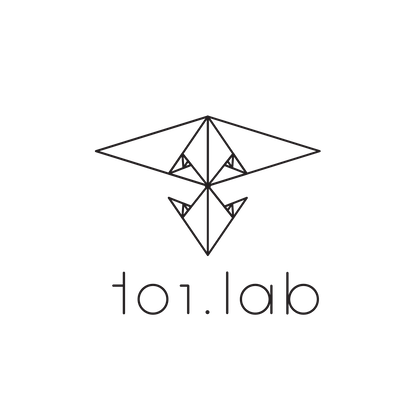

# toibot1 (for NUC w/ Celeron)

The project is in ROS but it calls a few functions that are called within virtual environments. 
To build the virtualenv:

1. Create Virtualenv
gal@gushu:~$ virtualenv -p python3 ./ToiBotEnv
2. Activate
source ToiBotEnv/bin/activate
3. Go into folder
Cd ToiBotEnv
4. Get pip
 sudo apt-get install python3-pip
5. Get some dependencies
sudo pip3 install ohbot
sudo apt-get install festival
sudo apt-get install python3-lxml
6. If dependencies are installed here: /usr/local/lib/python3.6/dist-packages/ohbot
Move them manually to new env: /home/gal/ToiBotEnv/lib/python3.6/site-packages/ohbot 
7. Give permissions to use port
sudo chmod 666 /dev/ttyACM0
8. Run test script to check it speaks and moves
9. Connect script to dialogFlow agent:
export GOOGLE_APPLICATION_CREDENTIALS="/home/path/to/your/json/file.json"
10. Try to run and Get dependencies:
pip3 install pyaudio
Pip install dialogflow
11. Change paths to:
Sound files
Google credentials

## Toibot1 was supported by the awesome people at toilab

